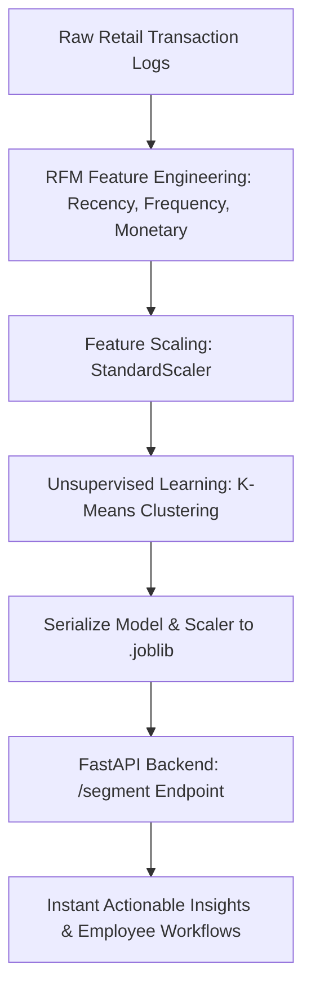

# 🛒 Retail Customer Segmentation & RFM Clustering API

Welcome to the **Retail Customer Segmentation API** repository! This project tackles a core operational challenge in retail: moving away from one-size-fits-all marketing by using unsupervised machine learning to automatically group shoppers into behavioral segments.

---

## 🚀 Project Architecture & Workflow



##**📁 Repository Structure**
* customer_segmentation.ipynb — The complete interactive lab notebook detailing data simulation, RFM calculations, K-Means clustering, and model serialization.
* app.py — The production FastAPI backend script that loads the trained scaler and K-Means model to classify customer profiles in real-time.
* models/customer_segment_model.joblib — The serialized K-Means clustering model.
* models/rfm_scaler.joblib — The saved feature scaler to normalize incoming data points.

## 🛠️ How to Run Locally
* Clone the repository and navigate to the project folder using your terminal or command prompt.
* Install the required dependencies:
  ```
  pip install fastapi uvicorn joblib pandas scikit-learn pydantic
  ```
* Run the FastAPI server using Uvicorn:
  ```
  uvicorn app:app --reload
  ```
* Test the API: Open your browser and navigate to http://127.0.0.1:8000/docs to access the interactive Swagger UI and test customer classifications live!

## 🎮 Mini Challenge for Learners
* Open http://127.0.0.1:8000/docs, click on the POST /segment button, hit Try it out, and pass custom customer metrics (e.g., recency: 45, frequency: 2, monetary: 1500) to see which behavioral tier and employee action the AI assigns!
